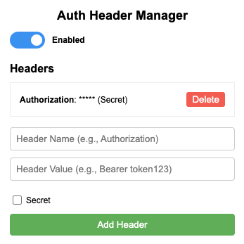

# Auth Header Manager

A Chrome extension that allows you to easily add and manage custom authentication headers for web requests with a simple toggle switch.

## Features

- 🔄 Simple ON/OFF toggle to enable/disable all headers
- ➕ Add multiple custom headers with name and value pairs
- 🗑️ Delete individual headers when no longer needed
- 💾 Persistent storage of headers between browser sessions
- 🔒 Perfect for adding Authorization headers to API requests

## Installation

### Chrome Web Store
*Coming soon*

### Manual Installation
1. Download or clone this repository
2. Open Chrome and navigate to `chrome://extensions/`
3. Enable "Developer mode" using the toggle in the top-right corner
4. Click "Load unpacked" and select the extension folder
5. The extension icon should appear in your Chrome(ium) toolbar

## Usage

1. Click the extension icon in your Chrome toolbar to open the popup
2. Use the toggle switch to enable/disable the extension
3. Add new headers by entering a name (e.g., "Authorization") and value (e.g., "Bearer token123")
4. Click "Add Header" to save the header
5. Added headers will appear in the list and can be deleted if needed
6. Headers will be automatically applied to all web requests when the extension is enabled

## Use Cases

- Testing APIs that require authentication
- Accessing protected resources during development
- Adding custom headers to requests without modifying application code
- Quickly toggling authentication on/off for debugging purposes

## Technical Details

This extension uses Chrome's `declarativeNetRequest` API to modify headers, which is the modern approach for header manipulation in Chrome extensions (Manifest V3). All header data is stored locally in the browser using Chrome's storage API.

## Browser Compatibility

- Chrome: Version 88 or later
- Edge: Version 88 or later (Chromium-based)
- Opera: Version 74 or later (Chromium-based)
- Brave: All versions (Chromium-based)

## Contributing

Contributions are welcome! Please feel free to submit a Pull Request.

1. Fork the repository
2. Create your feature branch (`git checkout -b feature/amazing-feature`)
3. Commit your changes (`git commit -m 'Add some amazing feature'`)
4. Push to the branch (`git push origin feature/amazing-feature`)
5. Open a Pull Request

## License

This project is licensed under the MIT License - see the [LICENSE](LICENSE) file for details.

## Acknowledgments

- Thanks to all contributors who have helped make this extension better
- Inspired by the need for a simple, flexible header management tool for web development

## Support

If you encounter any issues or have questions, please [open an issue](https://github.com/yourusername/auth-header-manager/issues) on GitHub.